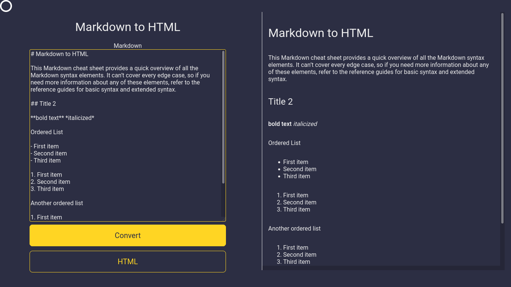

# Markdown to html

An example of a web page that convert markdown syntax to html.

**This example only convert the following syntax of markdown:**

- Heading
- Bold
- Italic
- Blockquote
- Ordered List
- Unordered list